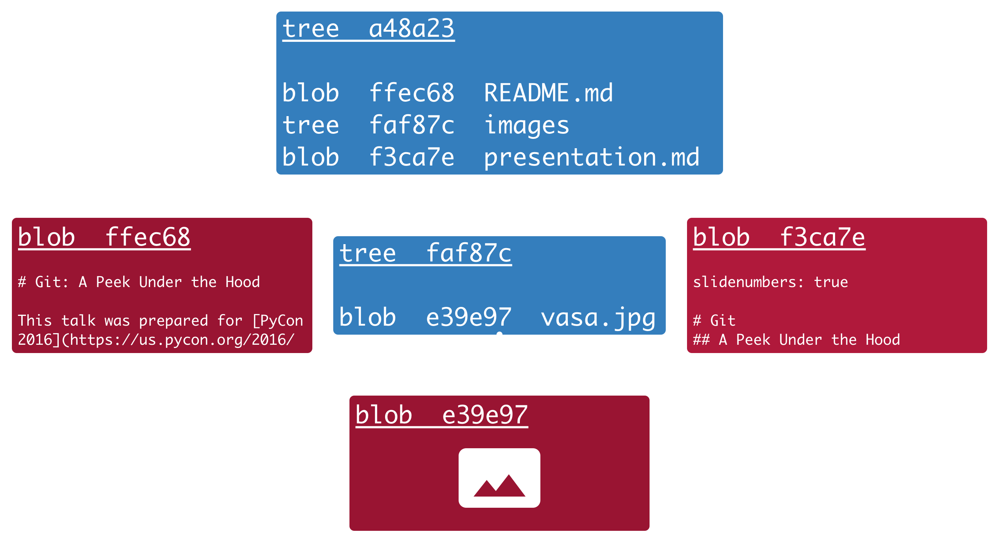
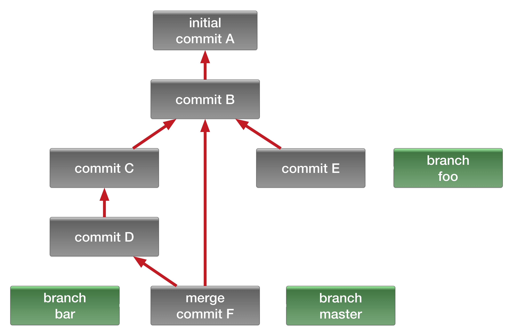
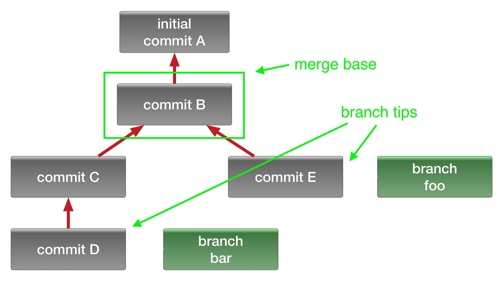
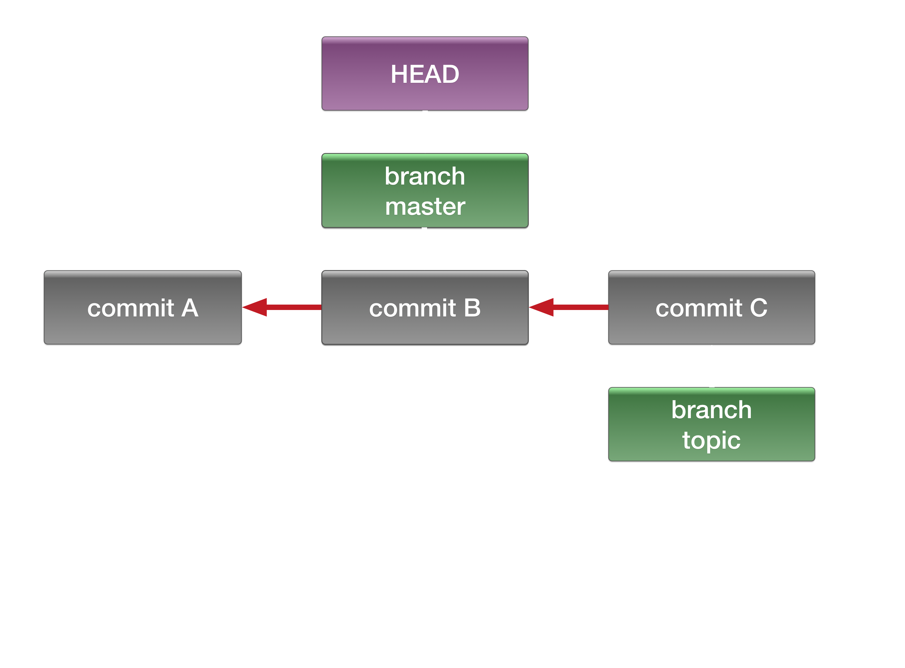
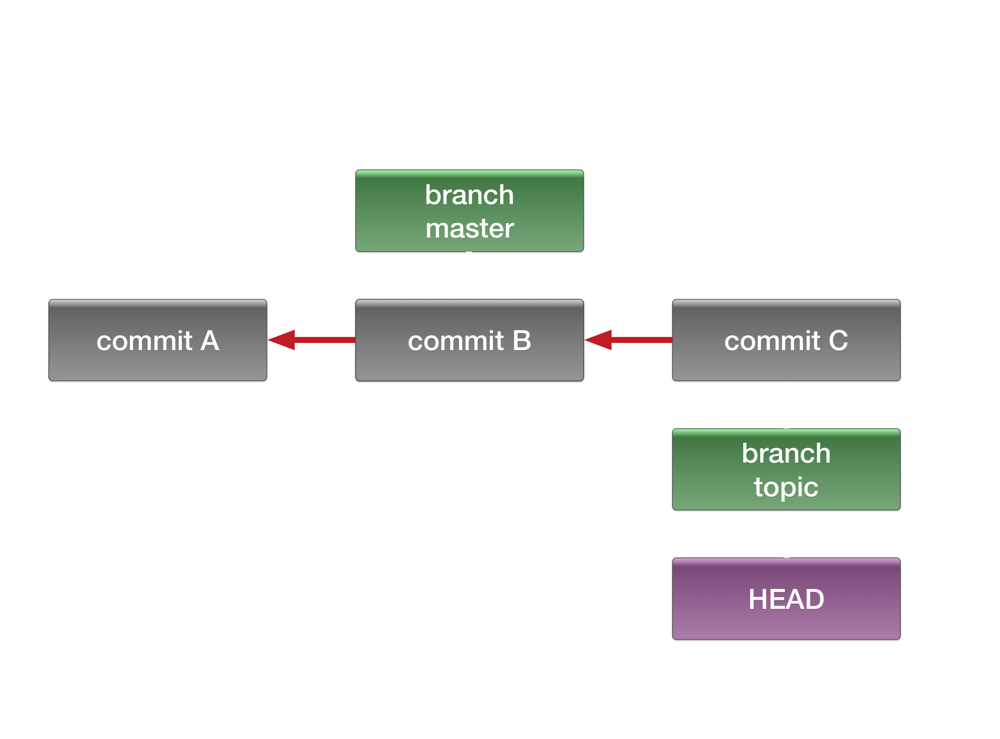
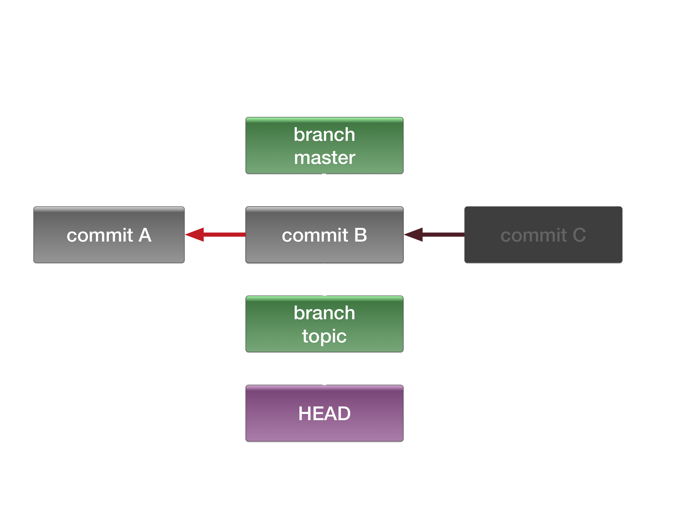
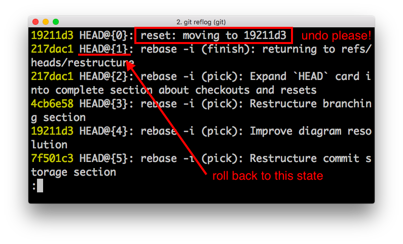
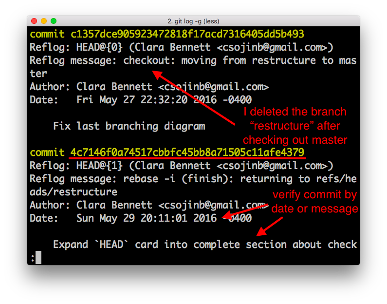

slidenumbers: true

# git
## a peek under the hood

### Clara Bennett
### PyCon 2016


---
# My Goal

_To improve your mental model of **git** and give you tools to continue learning and become a more effective git user._


This talk is not:

* An introduction to git for novice users
* A tutorial in "advanced" git techniques
* A deep dive into git internals or "plumbing" commands

---

# What does git store when you commit?


---
## Core Concept: History as Snapshots

* To understand how git stores your commits, it's useful to understand the central "philosophy"
* Git "thinks" about version history as a series of **snapshots**, rather than a series of deltas
* A **snapshot** is a complete copy[^1] of the project at a particular point in history

[^1]: Unchanged files are not stored multiple times. And, eventually, git will compress versions of the same file together to save space when necessary, e.g. if you want to push to a remote. But the snapshot still decompresses to a complete project copy.

---


# Representing Changes

* Git does not directly save any **actions** that you took, only the **state**
* Differences are **derived** by comparing snapshots
* Actions are **inferred**
* Example (right): git recognizes the rename because the **file contents** is the same
    * Equivalent to `git mv`
## Important implication!

* Git's ability to track a file's history[^2] depends on the file being recognizably the same file between commit snapshots
* i.e. the following may break the file history:

    `$ git mv file.py other.py`

    _<make lots of changes to `other.py`>_

    `$ git add --all; git commit`

[^2]: You may be taking advantage of this feature in, say, GitHub, even if you aren't using it locally.

---
# Snapshot Storage

* A file snapshot is stored as a text blob, and a directory snapshot is represented as a "tree" object
* Each snapshot is check-summed and stored by SHA-1 value
* Directory trees point to the SHAs of files and directories they contain
* The project snapshot is just the "tree" for the project root directory



---
# Building A Commit

* To make a commit, first you need to stage some changes
* The staging area[^3] is just another project snapshot tree
* As changes are staged, new snapshots are created of the affected files/directories, and the staging area is updated
* On commit, the staging area becomes the commit snapshot

[^3]: Sometimes referred to as the "index".

---
# The Meta-Data

* The final commit object contains a pointer[^4] to the **project snapshot** (the content) and some **meta-data**
* The meta-data includes the author, the commit message, and pointer(s) to the **parent commit(s)**[^5]
* Note that if either the content or the meta-data is amended, the new commit will have a different SHA checksum value

[^4]: The "pointer" is SHA of the project snapshot

[^5]: The initial commit has no parents, and merge commits have two or more.

---
## Visualizing commit storage


---
# Why are branches "cheap"?


---
## Branching (structure) comes for free


* Together, commits and parent relations form the git history DAG[^6]
* Multiple commits can share a parent => natural "branching" structure
* Could theoretically manage divergent version paths without an explicit "branch" concept[^7]

[^6]: It can be further specified as a rooted connected directed acyclic graph. :open_mouth: Note that the history is _not_ a tree because commits can have multiple parents, but it is tree-like in other respects.

[^7]: It would involve manually tracking commit SHAs, though. :scream:

---
## A git branch (object) is just a pointer



* Git's "branch" object (stored as reference to a commit SHA) affords two major conveniences:
    * Nice name for checkouts, etc
    * The checked-out branch moves forward with each new commit[^8]
* Note: the **master** branch is (technically) the same as any other[^9]

[^8]: Unlike tags (similarly just pointers), which stay put unless explicitly moved.

[^9]: The branch created by `git init` is called "master" by default.

---
## Ergo, branches are cheap

* Creating a branch == creating a SHA reference: cheap!
* Because git only creates new file snapshots for modified files, they are also cheap to maintain[^10]
* Deleting a branch deletes the ref only: also cheap!
    - Bonus: the commits still exist and [can be recovered](#recover-branch)

[^10]: Relative to other VCSs that maintain an entirely seperate project copy per branch.

---
## Merges are (fairly) easy

* To merge, git compares branches to their best **merge base**
* The merge base (most recent common ancestor) is easily determined from the commit graph
* Unlike a simple 3-point merge, git preserves granular history info by replaying commits from one branch onto the other
* This allows git to correctly handle many tricky merge situations, e.g. file renames

---
## Example merge scenario



To merge `bar` into `foo`:
    ```
    $ git checkout foo
    $ git merge bar
    ```

* Compute diffs `(C - B)` and `(D - C)`
* Apply diffs in order onto `E`
* Turn the result into a merge commit

---
# How do checkouts work?


---
# Checkouts: HEAD



* The HEAD reference determines "where you are" in the commit graph
* HEAD can point either to a branch reference or directly to a commit[^11]
* Example (right): The master branch is currently "checked out"

[^11]: This is the "unattached HEAD" state.

---
# Checkouts: Switching branches



`$ git checkout topic`

* Modify HEAD to point to `topic`
* Copy `commit C`'s snapshot tree to the staging area
* Decompress the files in the project snapshot and copy them to the working directory[^12]

[^12]: This could clobber uncommitted changes in your working directory, which is why git may throw an error if you try to do a checkout with a dirty working directory.

---
## Resets are similar



`git reset --<mode> master`

* A **hard** reset does the same 3 steps as a checkout, except that the pointer that moves is the **branch**, rather than HEAD
* A default (mode=**mixed**) reset skips the working directory overwrite
* A **soft** reset also skips the staging area overwrite

---
# How can I get myself out of trouble?


---
# Meet the reflog
## Your new best friend

* The reflog is a **local-only** log of all changes to git **ref(erence)s**, including branches, tags, HEAD, stashes
* By default, `git reflog` shows you a log of HEAD changes
* `git reflog <ref name>` to view changes to another ref
* The reflog can be used to **return to a previous state**[^13]

[^13]: A previous **committed** state. If you accidentally deleted uncommitted work, no dice. So, commit early and often!

---
# What can I find in the reflog?

* Some of the changes recorded in the reflog:
    - new commits (including merge commits, cherry-picks)
    - modifications to commits
    - branch or commit checkouts
* Fetches or pushes to a remote are not recorded in the reflog, because they don't affect your local repository copy

---
## Usecase
### Roll back to a previous state



* Use the reflog to immediately roll back from a git mistake (e.g. botched rebase, pulled instead of fetched)[^14]
* Identify the HEAD reference **before** the error, then do a hard reset to it
* Ex: `git reset --hard HEAD@{1}`

[^14]: You can even use this to recover from a bad reflog reset!

---
## Usecase
### Recover a deleted branch

<a name="recover-branch"/>



* We can't use the branch-specific reflog because it was deleted too
* View detailed commit information in the HEAD log with `git log -g`
* Find the SHA of the former branch tip and remake the branch:
    `$ git branch recovery 4c7146f`
* This technique can also be used to recover modified commits

---
## Off-branch commits aren't stored forever

* Git is conservative: it keeps commits reachable by any reference, including the reflog
* Default reflog expire time is 90 days
* Unless you explicitly trigger garbage collection, "expired" reflog items are only cleaned up if there's a space issue[^15]
* With the defaults, reflog expiry unlikely to cause issues

[^15]: So, a small repo that only you contribute to could still have commits from old branches from a year ago, for example.

---

## @csojinb


