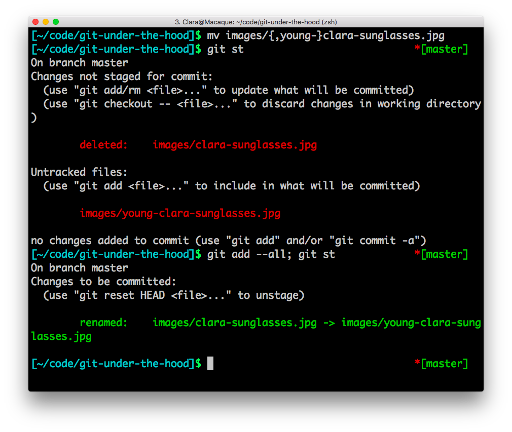
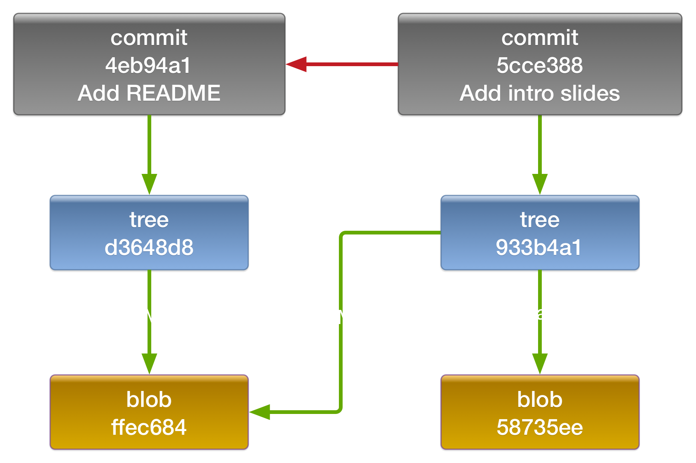
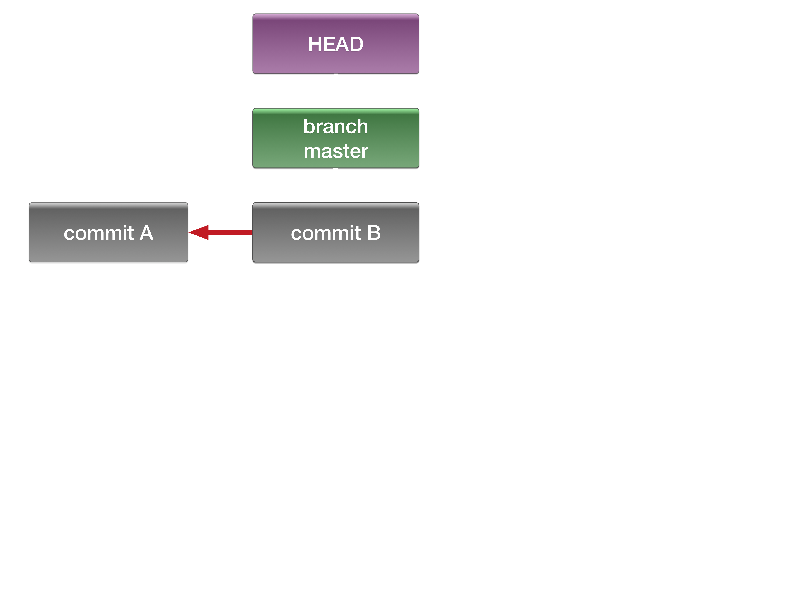
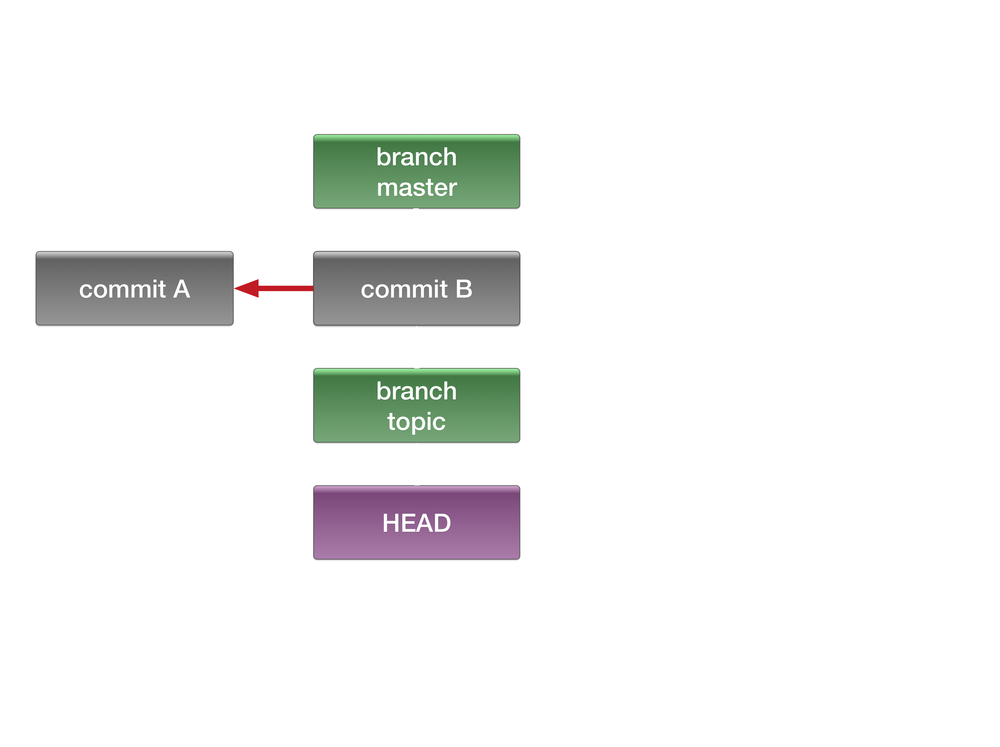
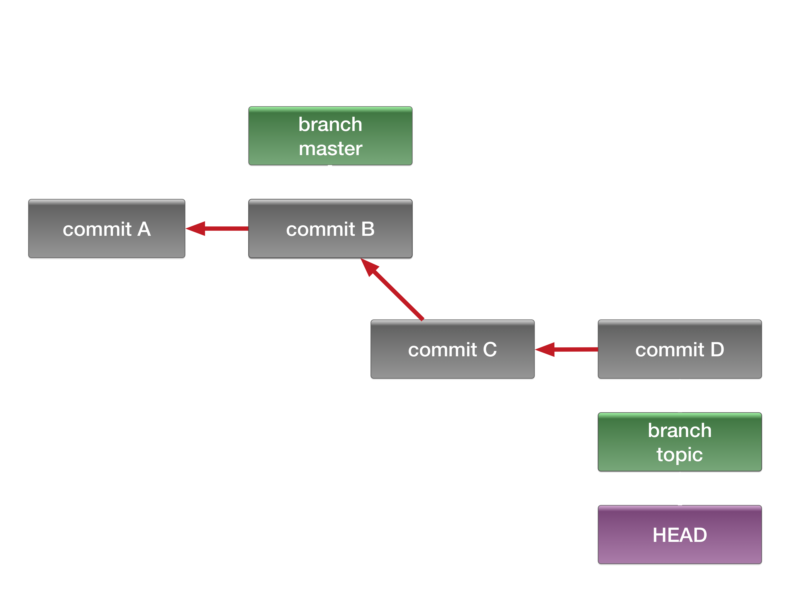
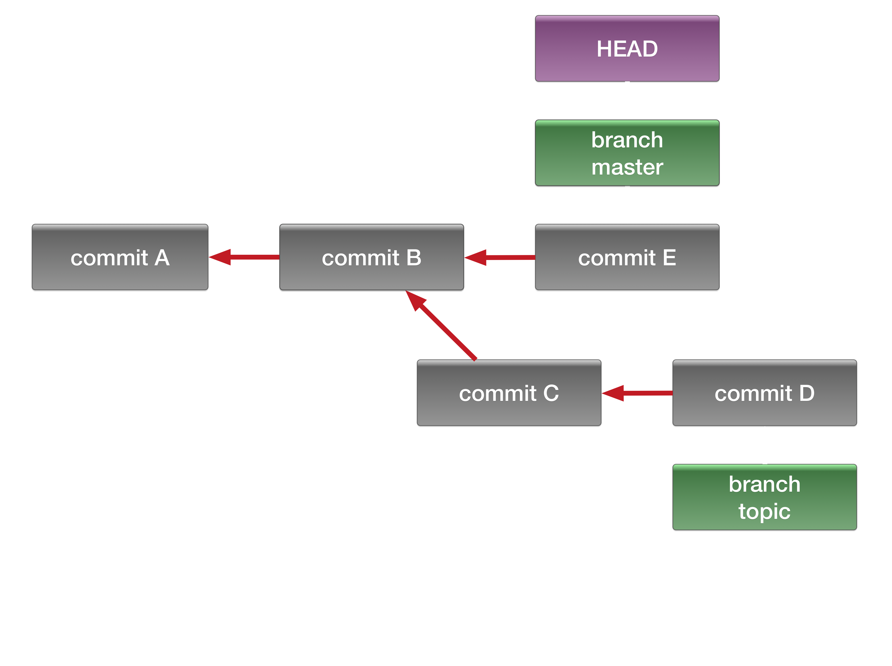

slidenumbers: true

# Git
## A Peek Under the Hood

### Clara Bennett
### PyCon 2016


---
# My Goal

_To improve your mental model of **git** and give you tools to continue learning and become a more effective git user._


This talk is not:

* An introduction to git for novice users
* A tutorial in "advanced" git techniques
* A deep dive into git internals or "plumbing" commands

---

# What does git store when you commit?


---
## Core Concept: History as Snapshots

* To understand how git stores your commits, it's useful to understand the central "philosophy"
* Git "thinks" about version history as a series of **snapshots**, rather than a series of changesets
* A **snapshot** is a complete copy[^1] of the project at a particular point in history

[^1]: Unchanged files are not stored multiple times. And, eventually, git will compress versions of the same file together to save space when necessary, e.g. if you want to push to a remote. But the snapshot still decompresses to a complete project copy.

---


# Representing Changes

* Git does not directly save any **actions** that you took, only the **state**
* Differences are **derived** by comparing snapshots
* Actions are **inferred**
* Example (right): git recognizes the rename because the **file contents** is the same
    * Equivalent to `git mv`

---
## Important implication!

* Git's ability to track a file's history[^2] depends on the file being recognizably the same file between commit snapshots
* i.e. the following may break the file history:

    `$ git mv file.py other.py`

    _<make lots of changes to `other.py`>_

    `$ git add --all; git commit`

[^2]: You may be taking advantage of this feature in, say, GitHub, even if you aren't using it locally.

---
# Snapshot Storage

* A file snapshot is stored as a text blob, and a directory snapshot is represented as a "tree" object
* Each snapshot is check-summed and stored by SHA-1 value
* Directory trees point to the SHAs of files and directories they contain
* The project snapshot is just the "tree" for the project root directory


---
# Building A Commit

* To make a commit, first you need to stage some changes
* The staging area[^3] is just another project snapshot tree
* As changes are staged, new snapshots are created of the affected files/directories, and the staging area is updated
* On commit, the staging area becomes the commit snapshot

[^3]: Sometimes referred to as the "index".

---
# The Meta-Data

* The final commit object contains a pointer[^4] to the **project snapshot** (the content) and some **meta-data**
* The meta-data includes the author, the commit message, and pointer(s) to the **parent commit(s)**[^5]
* Note that if either the content or the meta-data is amended, the new commit will have a different SHA checksum value

[^4]: The "pointer" is SHA of the project snapshot

[^5]: The initial commit has no parents, and merge commits have two or more.

---
## Visualizing commit storage



---
## Example: Understanding `git reset` options

`git reset [<mode>] HEAD~1`

* **mode = soft:** moves branch back to first parent; index and working directory unchanged _(changes remain "staged")_
* **default (mode = mixed):** moves branch back to parent; staging index reset to parent _(changes "unstaged")_
* **hard:** moves branch back to parent; index and working directory reset _(commit and changes erased entirely)_

---
# Branches, History, and Navigation


---
# The Commit "Tree"[^6]

* As previously mentioned, commits know about their parents
* Together, the commits and parent relations form the commit "tree", or history
* Multiple commits can have the same parent, which forms a natural "branching" structure

[^6]: Technically, it's not quite a tree, because merge commits have two or more parents. But, it seems easier to think about as an almost-tree than as a rooted connected directed acyclic graph. :sweat_smile:

---
# Branches Are Just Pointers

* A git branch is represented as a reference to a commit (which defines the "end" of the branch)
* The branch reference moves forward if new commits are added[^7] while that branch is checked out
* Deletion of a branch amounts to deletion of _the pointer only_: the commits are still in the database

[^7]: This is in contrast to tags (similarly just pointers to commits), which stay put unless explicitly moved.

---
# Where am I?

* The `HEAD` reference determines what is "checked out"
* If a branch is checked out, `HEAD` points to the branch ref
* The "unattached HEAD" state occurs when `HEAD` points directly to a commit
* Either way, the associated snapshot is identical[^8] to the state of the working directory

[^8]: Assuming that the working directory is clean, that is.

---
```
[~/dev/repo]$ git clone url .
```



---
```
[~/dev/repo](master)$ git checkout -b topic
```



---
```
[~/dev/repo](topic)$ git commit
```


---
```
[~/dev/repo](topic)$ git commit
```



---
```
[~/dev/repo](topic)$ git checkout master; git pull
```



---
# The Reflog
## Understand your actions and get out of trouble

---
# What is the reflog?

* The reflog is a **local-only** log of all changes to git _ref(erence)s_, which are pointers to git objects
    - Refs include: branches, tags, HEAD
* A freshly cloned repo has an empty reflog
* The reflog can help you understand how your actions affect the commit tree
* The reflog can be used to **return to a previous state**

---
# What can I find in the reflog?

* Some of the changes recorded in the reflog:
    - new commits (including merge commits, cherry-picks)
    - modifications to commits
    - branch or commit checkouts
* Things that are not recorded in the reflog:
    - fetches
    - pushes to a remote

---
# View the reflog

 

---
# Example
## Recover a modified commit


* Recall that commit "modification" actually creates a _new_ commit
* Previous "version" still exists
* Can create new branch to point to old commit:
`$ git branch recovery 82d84b2`
* Same technique can be used to recover a branch that was deleted

---

## @csojinb


